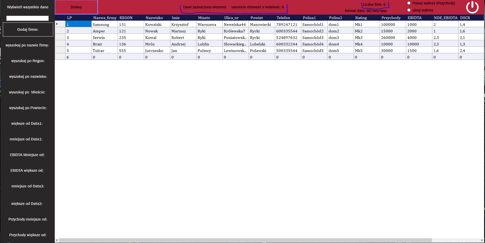

# Projekt
Program pobiera dane firm z pliku .csv
# Opis: Aplikacja napisana przy użyciu techonologi winForms.
## Program pobiera dane firm z pliku .csv do tabeli gdzie można wyszukiwać informacje, edytować dane, nastepnie zapisać dane znowu w pliku lub wydrukować.
## Ekran Główny:

## Usuwanie elementu:

## Wyszukiwanie danych:

## Wykres:

## Dodawanie firmy:

